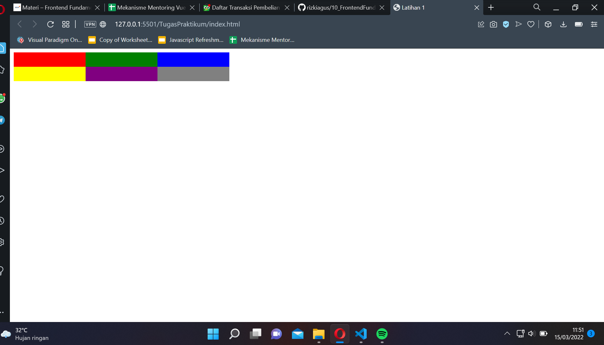

# 10 Frontend Fundamental

## Resume
Pada section ini mempelajari lagi mengenai html, css dan javascript

### HTML
html merupakan hypertext markup language, merupakan kerangka dari website

### CSS
digunakan untuk menambah style dari tampilan html, agar terlihat lebih indah.

### JS
digunakan untuk menambah fungsi - fungsi yang akan di gunakan pada website

## Task
pada section ini tugas praktikum yaitu membuat halaman website responsive dengan ketentuan yang sudah di berikan. Berikut merupakan hasil dari pekerjaan saya.
[LinkGithub](https://github.com/rizkiagus/10_FrontendFundamental/tree/latihan-materi-1)
