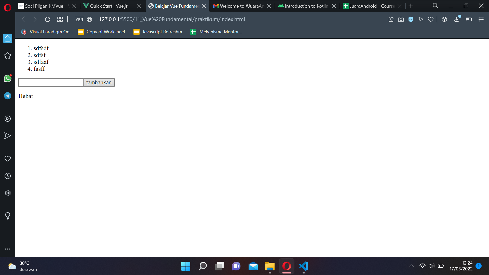

# 11 Vue Fundamental

## Resume

Pada section ini mempelajari:
1. Apa itu vue
2. Mengapa harus vue
3. Cara kerja vue

### 1. Apa itu vue
vue merupakan framework dari javascript untuk membuat tampilan lebih dinamis dan atraktif

### 2. Mengapa harus vue
1. mudah dipelajari
2. mudah membuat aplikasi frontend dan website
3. dokumentasi yang lengkap

### 3. Cara kerja vue
vue dapat digunakan melalui CDN, atau dengan menggunakan CLI

## Task
Pada section ini membuat sebuah todolist sederhana menggunakan vue, berikut merupakan hasil dari pekerjaan saya.
