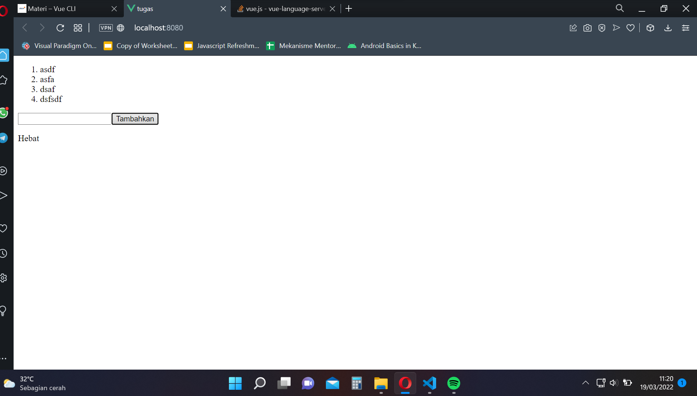

# Vue CLI

## Resume
Pada section ini mempelajari mengenai vue cli, cara menginstall nya, dan komponen file tunggal dalam vue.

### 1 Vue CLI
adalah cara untuk menggunakan framework Vue dengan menginstall nya langsung ke sistem, menggunakan Command Line Interface

### Cara Install Vue
dengan mengetik npm i -g @vue/cli

### Komponen File Tunggal
merupakan file yang dapat menampung semua yang ingin kita buat dalam html.

## Task
Pada section ini, mendapatkan tugas untuk membuat todolist sederhana menggunakan vue CLI, berikut merupakan hasil dari pekerjaan saya.
