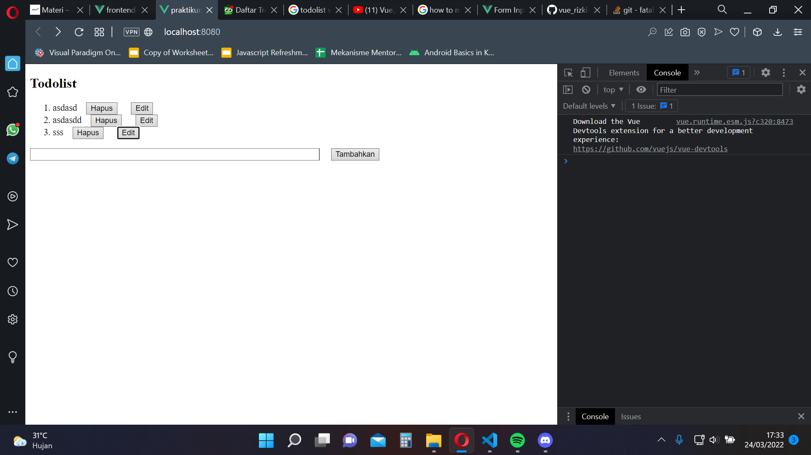

# 13 Vue Component

## Resume

Pada section ini mempelajari mengenai komponen yang ada pada vue, seperti props, emits, fungsi bantuan.

1. Props
   Merupakan variabel yang dapat dipasing ke parent.

2. Emits
   Merupakan event/listener yang dapat dipasing ke parent.

3. Fungsi Bantuan
   Merupakan fungsi yang dibuat dalam folder yang sejajar dengan folder component, yang digunakan untuk memanggil fungsi yang akan digunakan berulang kali.

## Task

Pada section ini tugas yang diberikan merupakan lanjutan dari tugas section kemaren, dimana todolist disini dapat di update, dan di hapus. Berikut merupakan hasil dari pekerjaan saya

