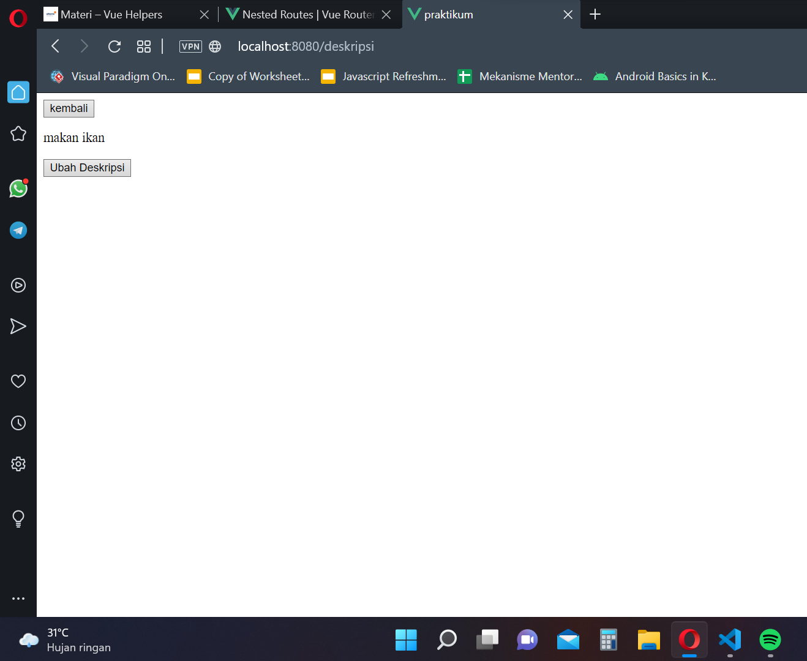

# 14 Vue Helper

## Resume

Pada section ini mempelajari mengenai komponen komponen pembantu pada vue, seperti navigasi, layout, dan penyimpanan global

1. Navigasi
   Navigasi merupakan kegiatan yang dilakukan untuk berpindah halaman dari halaman satu ke halaman lain.
2. Layout
   Layout adalah susunan tata letak dari halaman
3. Penyimpanan Global
   merupakan metode yang digunakan untuk dapat mengakses variable dari semua halaman website.

## Task

Pada section ini melanjutkan tugas dari section sebelumnya, tetapi menambah sebuah link untuk melakukan navigasi pada setiap list yang ada. Berikut merupakan hasil dari pekerjaan saya.

