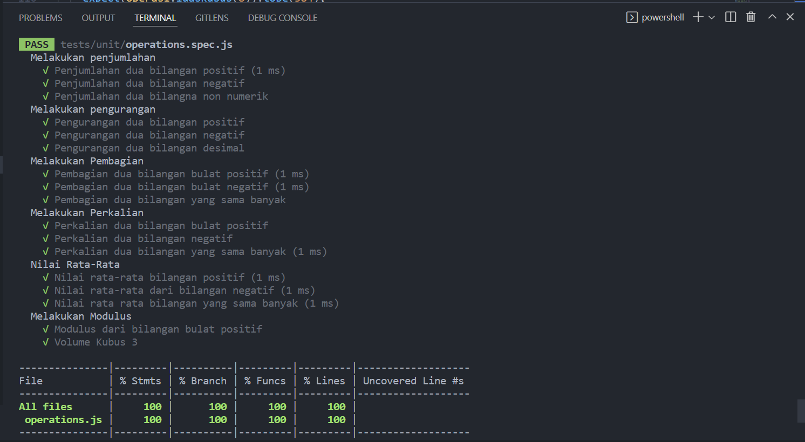

# 16 Vue Quality Control

## Resume

pada section ini membahas tentang unit testing menggunakan jest.
Jest merupakan dependencies yang disediakan oleh vue, untuk melihat apakah hasil dari koding yang dilakukan sesuai dengan yang kita inginkan.

## Task

Pada section ini mendapatkan tugas untuk melakukan unit test dengan beberapa cara. berikut merupakan hasil dari pekerjaan saya.

