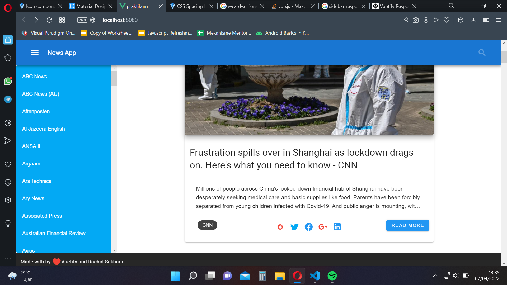

# 17 UI Framework

## Resume

Pada section ini mempelajari mengenai:

1. Vuetify
2. Manajemen Warna
3. Gelap Terang

### Vuetify

Vuetify merupakan library vue yang dapat membuat tampilan UI lebih indah.

### Manajemen Warna

Merupakan pengaturan set warna yang akan kita gunakan terhadap aplikasi website kita.

### Gelap Terang

Merupkana fitur untuk mengubah latar warna dari gelap menjadi terang begitu juga sebaliknya.

## Task

Pada section ini mendapatkan tugas memperbaiki tampilan aplikasi berita yang ada pada Vue Data menggunakan Vuetify. Berikut merupakan link dan tampilan dari tugas saya. [LINK](/15_Vue%20Data/praktikum/)

