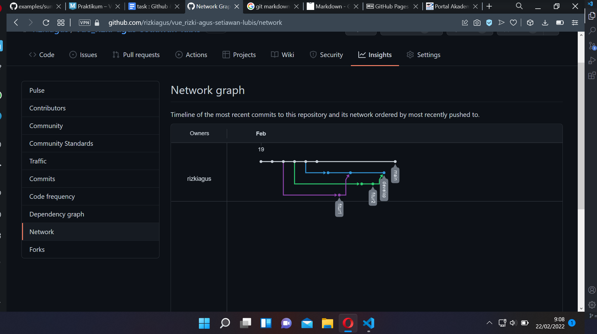

# 2 Version Control and Branch Managemant(Git)

## Resume
Dalam materi ini, mempelajari:
1. cara menginstall git.
2. stagging area.
3. branch dan history yang terjadi pada git.

### Cara menginstall git
Git dapat di install pada mac, linux, dan windows. Untuk menginstallnya dapat download melalui website git atau menggunakan sintaks (untuk linux).

### Stagging Area
Stagging area merupakan tempat penyimpanan semua file yang berubah sebelum di push ke github

### Branching dan History
Branch digunakan agar penambahan file tidak langsung masuk ke main branch.
History, digunakan untuk melihat apa saja yang kita lakukan dalam git tersebut.

## Task
### 1. Github

Pada tugas ini membuat 3 branch tambahan pada git. Dimana 1 branch digunakan untuk menampung fitur tambahan pada 2 branch setelahnya.

berikut merupakan hasil dari praktikum pada section ini:

### 2. Miniproject(UIUX)
Pada tugas ini membuat desain ui di figma.

berikut merupakan hasil dari tugas saya:
