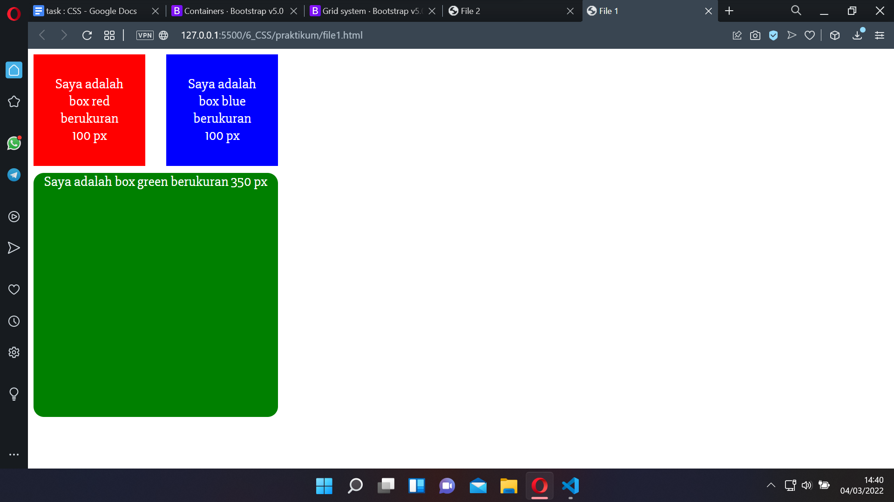
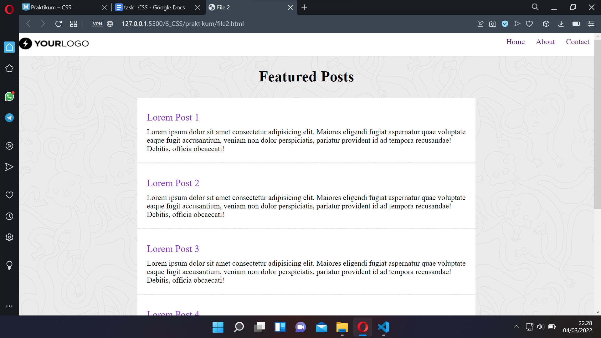

# 6 CSS

## Resume

Pada section ini mempelajari tentang:
1. CSS
2. CSS Boostrap
3. Implementasi css dan boostrap pada html

### CSS
CSS merupakan singkatan dari Cascading Style, yang digukanan untuk melakukan dekorasi atau memperindah halaman website.

### CSS Boostrap
boostrap merupakan library yang dapat digunakan pada html untuk mempersingkat styling pada css.

### Implementasi CSS dan Boostrap Pada Html
boostrap dan css dapat di implementasikan menggunakan tag link, untuk implementasi boostrap, dapat dilakukan dengan 2 cara, 1. dengan mendownload file boostrap itu sendiri, dan 2.menggunakan link yang tersedia  di website boostrap.

### Task
Pada section ini, praktikum berupa mengimplementasikan css dan boostrap pada html.
Berikut merupakan hasil dari praktikum tersebut.

