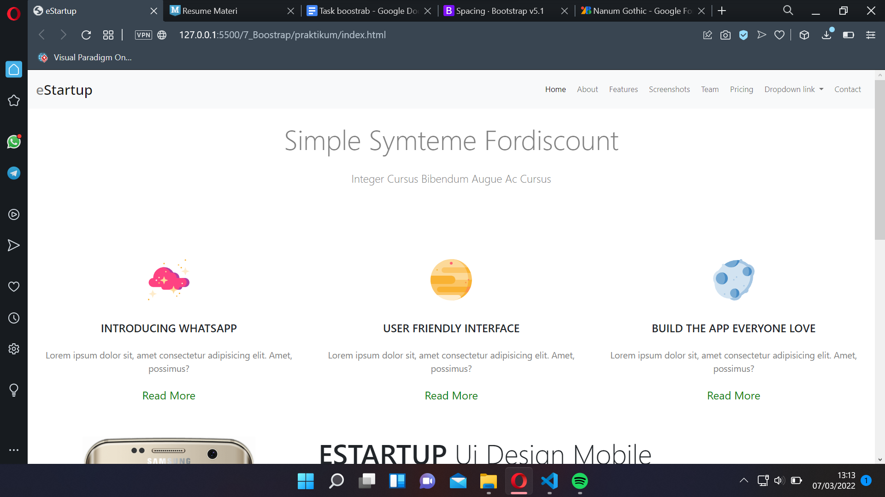
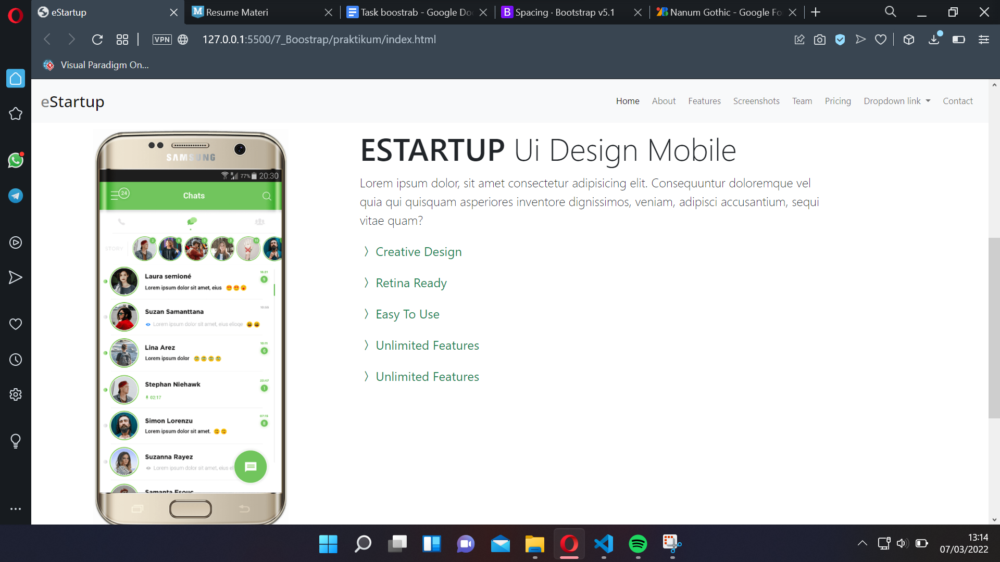
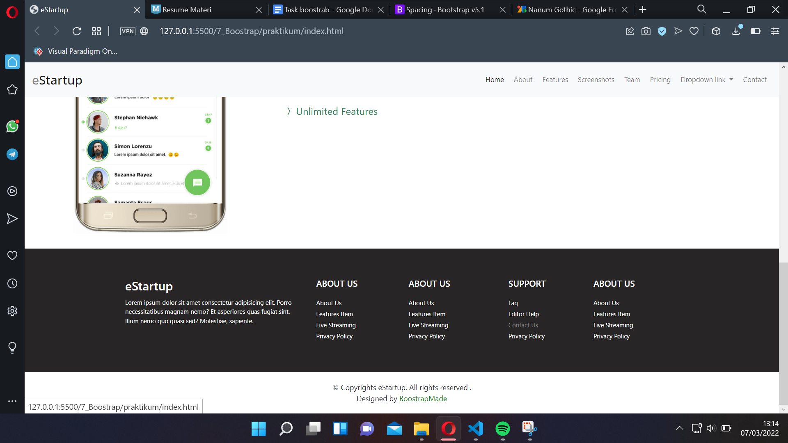

# 7 Boostrap

## Resume

Pada section ini belajar mengenai.
1. apa itu boostrap
2. kenapa harus boostrap
3. penggunaan boostrap pada website

### Apa itu bosstrap
Boostrap merupakan library yang dapat memudahkan kita untuk melakukan decorasi pada website.

### Kenapa harus bosstrap
boostrap merupakan library yang gratis, dan mudah di implementasikan.

### Penggunaan Boostrap pada website
menggunakan boostrap dapat dengan mengimport link cdn atau dengan download file boostrap.

## Task
Pada section ini tugas praktikum membuat halaman website menggunakan html, css dan boostrap.
Berikut merupakan hasil dari pekerjaan saya.
Bagian Navbar

Bagian Body

Bagian Footer
