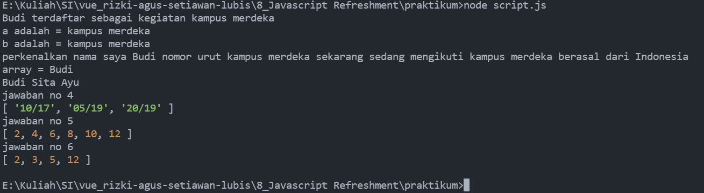

# 8 Javascript Refreshment

## Resume
Pada section ini belajar mengenai.
1. Javascript
2. Hoisting pada javascript
3. Pembuatan fungsi pada javascript

### Javascript
merupakan bahasa pemograman tingkat tinggi, semakin tinggi tingkatnya semakin mudah dibaca oleh manusia.

### Hoisting pada javascript
hoisting merupakan pemanggilan fungsi yang bisa saja belum dibuat, atau dibuat di bawah dari code pemanggin fungsi tersebut.

### Pembuatan fungsi pada javascript
ada berbagai cara untuk membuat fungsi pada javascrip, fungsi deklarasi, fungsi expresi, dan fungsi arrow.

## Task
pada section ini mendapatkan praktikum berupa mengerjakan case case menggunakan javascript, berikut merupakan hasil pekerjaan saya.
